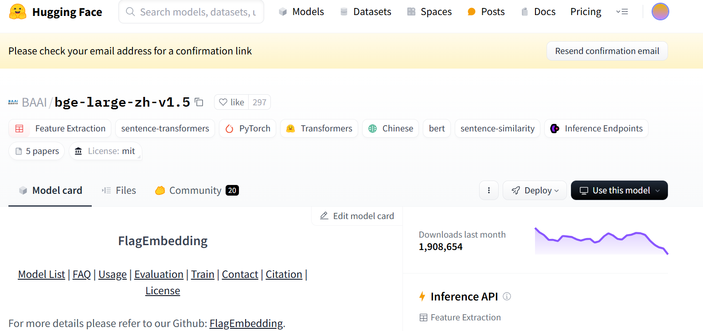
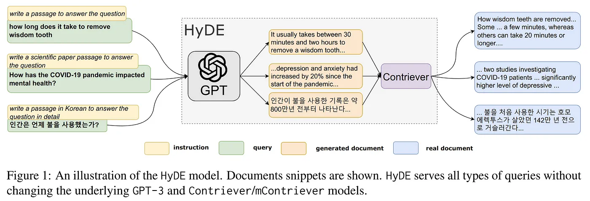

## <center>信息检索导论大作业 </center>
#### <center> ——LlamaIndex框架实现增强检索的足球私域知识对话模型 </center>
##### <center> 路欣艾  2021201226 luxinai_2003@ruc.edu.cn</center>

### 一、 实验要求

以ChatGPT为代表的大语言模型（LLM）在自然语言理解和生成方面展现出强大的能力，检索增强生成 (Retrieval-Augmented Generation, RAG) 技术是指在利用大语言模型回答问题之前，先从外部知识源检索相关信息，提供给大语言模型，这让LLM可以充分利用外部知识资源生成更准确和更符合上下文的答案。

本项目要求使用`LlamaIndex`框架，基于大语言模型和检索增强生成技术，构建一个可以回答2024年足球新闻问题的系统。


具体的要求包括：

> - 数据集：使用给定的2024年足球新闻文章数据集`（data.csv）`
> - 基础RAG系统实现：使用`LlamaIndex`框架构建基本的RAG系统，包括索引、检索和生成步骤。
> - 改进与优化：尝试不同的分块策略和大小、嵌入模型、多级索引、查询重写、混合检索和重新排序等方法来优化系统性能。
> - 评估：设计实验评估基础和改进后的系统，提供性能指标和实例。

### 二、实现思路

根据实验要求，本项目实现思路大致如下：

.png>)

首先利用`LlamaIndex`搭建最简单的对话模型，然后尝试在索引方式、混合检索、查询重写三个方面进行优化，最后将基本模型和优化后的模型`response`利用DeepEval架构种的4种评价指标进行评价，比较它们性能之间的不同。

### 三、`LlamaIndex`基本对话模型

#### 1. Openai API


```python

import os
from dotenv import load_dotenv

OPENAI_API_KEY = 'OPENAI_API_KEY' 
os.environ['OPENAI_API_KEY'] = 'OPENAI_API_KEY' 

load_dotenv()
```

#### 2. 数据集准备

读取`documents`，把文件用 `SimpleDirectoryReader` 方法存成 `documents`。

```python
import os
import gradio as gr
import openai

from llama_index.core import VectorStoreIndex,SimpleDirectoryReader,
ServiceContext,PromptTemplate
from llama_index.core.schema import IndexNode

from llama_index.core import (
    GPTKeywordTableIndex,
    SimpleDirectoryReader,
    ServiceContext
)

documents = SimpleDirectoryReader(input_dir='./data').load_data()
```
#### 3. 建立`OpenAIEmbeddings`索引

采用最普通的索引方式`OpenAIEmbeddings`，这个过程会自动构建`documents`的`nodes`。
```python
from llama_index.core import VectorStoreIndex,DocumentSummaryIndex
from langchain_openai import OpenAIEmbeddings

# OpenAIEmbeddings()  
print("OpenAIEmbeddings:")
index_OpenAIEmbeddings = VectorStoreIndex.from_documents(documents = documents,
 embedding = OpenAIEmbeddings(), show_progress = 1)
```
构建索引的过程：


#### 4. RAG检索引擎生成回复 `get_response(query)`
```python
# 这个位置可以替换不同的嵌入模型搞的引擎
query_engine = index_OpenAIEmbeddings.as_chat_engine(verbose=True)

# get_response函数定义
def get_response(query):
    response = query_engine.query(query)
    return response
```

#### 5. `Gradio`交互界面

```python
import gradio as gr
from gradio.components import Textbox

# 创建Gradio界面
iface = gr.Interface(
    fn=get_response,
    inputs=gr.components.Textbox(lines=5, label="输入提示文本"),
    outputs="text",
    title="小鹿的足球信息检索系统",
    description="使用 gpt-3.5 + 最新足球新闻的rag检索系统"
)

# 启动Gradio界面
iface.launch()
```

【界面与问答效果】输入问题后，点击`Submit`按钮，提交用户的问题，引擎将增强检索后的回答输出在右侧`output`对话框中；用户可以通过点击`Flagged`将问题与引擎的答复保存在后端文件中；用户可以通过点击左侧`Clear`按钮将问题清空后重新提问。


### 四、模型优化
#### 1. 两种不同`HuggingFace`嵌入模型
##### （1）`bge-large-zh-v1.5`




定义 `index_bge_large_zh`为使用该嵌入模型的索引名称。

```python
# bge-large-zh-v1.5
print("bge-large-zh-v1.5:")
bge_embeddings = HuggingFaceBgeEmbeddings(model_name="BAAI/bge-large-zh-v1.5")
index_bge_large_zh = VectorStoreIndex.from_documents(documents = documents, 
                embedding = bge_embeddings, show_progress = 1)
```
生成`response`样例：


##### （2）`bge-M3`

`BGE-M3`是首个集多语言（Multi-Linguality）、多粒度（Multi-Granularity）、多功能（Multi-Functionality）三大技术特征于一体的语义向量模型，极大提升了语义向量模型在现实世界的可用性。目前，`BGE-M3`已向社区全面开源。

定义 `index_bge_M3`为使用该嵌入模型的索引名称。

```python
# bge-M3
print("bge-M3:")
bgeM3_embeddings = HuggingFaceBgeEmbeddings(model_name="BAAI/bge-M3")
index_bge_M3 = VectorStoreIndex.from_documents(documents = documents, 
                embedding = bgeM3_embeddings, show_progress = 1)
```
生成`response`样例，可以看到，当询问的问题是“你是什么模型”时，增强后的引擎会加上足球相关的私域知识。


#### 2. 混合检索
##### (1) 预处理文档集
将`document`转换成可供`BM25Retriever`和`FAISS`对象使用`.from_texts()`初始化方法的格式`list`

```python
# 定义空的文本列表
doc_texts = []
splitted_texts = []

# 遍历每个文档对象，获取文本内容和元数据
for i, doc in enumerate(documents):
    text = doc.text  # text 属性用于获取文本内容
    if text:
        doc_texts.append(text)
    else:
        doc_texts.append("")  # 如果文本内容为空，添加一个空字符串

# 遍历每个文本内容，按照 "http" 进行分割
for text in doc_texts:
    # 使用 split 方法按照 "http" 进行分割，并加入到分割后的文本列表中
    splitted_texts.extend(text.split("http"))

# 将文档转换为文本列表和元数据列表
doc_metadatas = [{"source": i} for i in range(len(splitted_texts))]
```

##### (2) 定义稀疏检索`BM25Retriever`和稠密检索`FAISS`
```python
# 尝试混合检索方式
from langchain_community.retrievers import BM25Retriever
from langchain_community.vectorstores import FAISS
from langchain_openai import OpenAIEmbeddings

# 初始化BM25检索器
bm25_retriever = BM25Retriever.from_texts(splitted_texts, metadatas = doc_metadatas)
bm25_retriever.k = 3

# 初始化FAISS检索器
embedding = OpenAIEmbeddings()
faiss_vectorstore = FAISS.from_texts(splitted_texts, embedding, metadatas=doc_metadatas)

# 将FAISS向量存储转化为检索器
faiss_retriever = faiss_vectorstore.as_retriever(search_kwargs={"k": 3})

```

##### (3) 定义混合检索`EnsembleRetriever`
```python
# 尝试混合检索方式
from langchain.retrievers import EnsembleRetriever
from langchain_openai import OpenAIEmbeddings

# 初始化Ensemble Retriever
ensemble_retriever = EnsembleRetriever(
    retrievers=[bm25_retriever, faiss_retriever], weights=[0.5, 0.5]
)
```
##### (4) 使用混合检索，找到和问题相关的文档
```python
# 使用Ensemble Retriever进行检索
query = "曼联队员在3-0战胜西汉姆的比赛中都是怎样表现的？"
docs = ensemble_retriever.invoke(query)

for doc in docs:
    print(f"Document ID: {doc.lc_id}")
    print(f"Content: {doc.page_content}")
    print("\n---\n")
```

查询到的相关文档：


##### (4) 将混合检索结果与问题合并，让引擎生成`response`

```python
# 将相关文档内容组合成一个字符串，传递给query_engine
doc_contents = "\n".join([doc.page_content for doc in docs])

combined_query = f"我的问题是：{query}。我已知下面这些信息：{doc_contents}。
                                请你根据这些内容回答。"

# 使用query_engine进行总结和回答
response = query_engine.query(combined_query)

# 打印结果
print(response)
```
查询文本生成过程：


返回的`response`:


> 在曼联3-0战胜西汉姆的比赛中，曼联队员表现出色，他们成功取得胜利，拉什福德、Højlund和McTominay分别攻入进球。此外，拉什福德的表现引人注目，他在最近四场英超比赛中要么进球要么助攻。Højlund也状态良好，在过去五场比赛中在各项赛事中有六次进球参与。尽管存在一些防守问题，但球队能够派出强大的阵容，关键球员回归，他们成功取得了关键的胜利。而在这场比赛中，西汉姆队员并没有表现出色，因为在提到的情况下，实际比赛是西汉姆在伦敦体育场的反向比赛中以2-0获胜。
>
> 
#### 3. `HyDE`查询重写

`HyDE`原理的核心思想是通过生成假设性文档来优化查询表示，从而提升检索结果的相关性和准确性。



使用`HyDE`模型实现查询重写优化技术：
```python
# Hyde查询重写的结果
from llama_index.core.indices.query.query_transform import HyDEQueryTransform
from llama_index.core.query_engine import TransformQueryEngine

query_engine = index_bge_M3.as_chat_engine(verbose=True)

# hyde 查询重写
hyde = HyDEQueryTransform(include_original=True)
hyde_query_engine = TransformQueryEngine(query_engine, hyde)
response = hyde_query_engine.query("曼联队员在3-0战胜西汉姆的比赛中都是怎样表现的？")
```
是/否查询重写的`response`比较：


`response`的具体内容如下，似乎不能说有改善。

【Base Query】
> 曼联队员在3-0战胜西汉姆的比赛中表现出色。拉什福德和霍伦德早早进球，麦克托米奈在下半场替补出场时攻入第三球。此外，科比·迈努在补时阶段打入一球，为曼联取得了胜利。

【HyDE Query】
> 曼联队员在3-0战胜西汉姆的比赛中表现出色，他们控制了比赛并创造了机会，拉什福德和Højlund早早进球。尽管有些防守问题，但他们成功地舒适地赢得了比赛。

### 五、使用`DeepEval`对RAG系统测试
#### 1. 测试整体思路
测试一共要测试三种变量：哪种embedding、是否混合检索、是否查询重写，对这三个变量形成的组合进行5个指标的测评

- **测试embedding**</br>
**控制变量**:不混合检索、不查询重写 </br>
**测试**:更换index_OpenAIEmbeddings、index_bge_large_zh、index_bge_M3，看指标</br>

- **测试混合检索** </br>
**控制变量**：使用index_OpenAIEmbeddings，不查询重写 </br>
**测试**：是否混合检索 </br>

- **测试查询重写** </br>
**控制变量**：使用index_OpenAIEmbeddings，不混合检索 </br>
**测试**：是否查询重写 </br>

#### 2. 测试数据集准备
针对原始数据集中的新闻，本测试过程采用OpenAI公司的`gpt-4o`模型生成了20个细节问题和答案，其中，问题存为`questions`，答案存为`expected_outputs`。之所以选取20个问题，是因为openai的api接口在调用时有限额，且整个指标计算过程较慢，从经济成本和时间成本两方面考虑，本测试过程的问题集容量选取20较为合适。

问题集`query_new`:
>- 在这次转会窗口，巴塞罗那计划如何处理财政问题以引进Amadou Onana？
>- Karim Benzema在沙特阿拉伯遇到了哪些问题，这对他和俱乐部有何影响？
>- 曼联球员Lisandro Martinez受伤后，球队的战术和阵容发生了什么变化？
>- Ferran Torres在比赛中向一名癌症患者致敬，这对球员和球迷有何意义？
>- 为什么Takehiro Tomiyasu在对阵West Ham United的比赛中缺席？他何时可能会重返阵容？
>- 巴塞罗那被Villarreal重创后，他们与皇马的积分差多少？这对巴萨的联赛前景有何影响？
>- Cole Palmer在切尔西对阵水晶宫的比赛中表现出色，他提到了Mauricio Pochettino在胜利中的作用是什么？
>- 在对阵阿斯顿维拉的比赛中，切尔西的球迷建议的终极阵容是什么？
>- 在对阵托特纳姆热刺的比赛中，曼联球迷对马库斯·拉什福德的表现有什么意见？
>- 吉安路易吉·布冯表示在他职业生涯中哪个前锋对他造成了最大的痛苦？
>- 切尔西的蒂亚戈·席尔瓦在对阵水晶宫的比赛中做了什么冒险行为？
>- 2023年斯坦福桥的比赛中，哪位球员在第71分钟进球使阿斯顿维拉战胜切尔西？
>- 切尔西在2024年足总杯第三轮中以4-0战胜了哪支球队？
>- 在2024年2月初对阵埃弗顿的比赛中，阿斯顿维拉取得了什么结果？
>- 切尔西在2024年与阿斯顿维拉的比赛中，预计最有可能的比分是什么？
>- 2024年利物浦对阵阿森纳的比赛中，克洛普是否对达尔文·努涅斯不上场感到后悔？
>- 克洛普在2024年对阵阿森纳的比赛中，提到球队应该如何提高？
>- 康纳·加拉格尔在2024年对阵水晶宫的比赛中打进了多少球？
>- 康纳·加拉格尔在对阵水晶宫的比赛中，被评为比赛最佳球员后提到了什么关于主教练的战术调整？
>- 梅西、苏亚雷斯、阿尔巴和布斯克茨在2024年为哪支球队展示了他们的出色配合？

答案集`expected_output`（数据类型为`list`）：

>- 巴塞罗那计划通过出售一些球员来筹集资金，可能会将Frenkie De Jong和Ronald Araujo列入出售名单，以便购买Amadou Onana。
>- Karim Benzema与Al Ittihad的主教练Marcelo Gallardo发生了冲突，这可能对他在俱乐部的未来产生影响，并可能影响球队的氛围和战绩。
>- Lisandro Martinez受伤后，曼联可能需要调整他们的防守组织和中场配置，可能会影响他们在比赛中的表现和战术风格。
>- Ferran Torres的这个举动展现了他的人道主义精神和对球迷的关怀，这可能会赢得更多球迷的支持和尊重，同时也为球迷带来了温暖和鼓舞。
>- Takehiro Tomiyasu因为国家队比赛后出现了小伤，所以缺席了比赛。目前尚不清楚他何时可以重返阵容，但希望他的伤势只是轻微的问题。
>- 巴塞罗那在主场被Villarreal以5-3击败，导致他们与皇马的积分差距达到了10分。这对巴萨本赛季的联赛前景造成了不小的影响，使得他们的冠军希望受到挑战。
>- Cole Palmer提到了Mauricio Pochettino在胜利中的作用，称赞了他的指导和支持，认为Pochettino对球队的凝聚力和信心给予了很大的帮助。这表明了Pochettino在切尔西的作用和影响。
>- Petrovic；迪萨西、蒂亚戈·席尔瓦、巴迪亚希尔；奇尔维尔、凯塞多、恩佐、古斯托；帕尔默、杰克逊、恩昆库。
>- 尽管拉什福德打入一球，但有一部分球迷对他的表现不满意，认为他决策糟糕，影响了球队进攻。有球迷甚至呼吁曼联在夏季将他出售。
>- 布冯表示是克里斯蒂亚诺·罗纳尔多，总是能在比赛中攻破他的球门，尤其是2018年欧冠四分之一决赛中的倒钩进球。
>- 蒂亚戈·席尔瓦冒着受伤的风险，封堵了马特塔的一次射门，但在此过程中脚踝扭伤，被利维·科尔威尔替换下场。
>- 奥利·沃特金斯 (Ollie Watkins)
>- 普雷斯顿北区 (Preston North End)
>- 平局
>- 1-1
>- 克洛普表示他不会改变首发阵容，但在比赛后可能会有不同的想法。
>- 克洛普认为球队需要踢得更好，并在接下来的比赛中展现出更好的足球水平。
>- 两个
>- 主教练在中场休息时改变了球队在对方半场的结构，使球队在下半场创造了更多机会。
>- 迈阿密国际


#### 2. `DeepEval`评估指标选取
##### （1）`G-Eval`

官方文档对`G-Eval`指标的描述：

```python
correctness_metric = GEval(
    name="Correctness",
    criteria="Determine whether the actual output is factually"+
    "correct based on the expected output.",
    # NOTE: you can only provide either criteria or evaluation_steps, and not both
    evaluation_steps=[
        "Check whether the facts in 'actual output' contradicts " + 
        "any facts in 'expected output'",
        "You should also heavily penalize omission of detail",
        "Vague language, or contradicting OPINIONS, are OK"
    ],
    evaluation_params=[LLMTestCaseParams.INPUT, LLMTestCaseParams.ACTUAL_OUTPUT],
)
```
定义`G-Eval`矩阵：
```python
# 引入评估指标1：G评估
from deepeval.metrics import GEval
from deepeval.test_case import LLMTestCaseParams
from deepeval.test_case import LLMTestCase

correctness_metric = GEval(
    name="Correctness",
    model="gpt-3.5-turbo",
    criteria="Determine whether the actual output is factually correct" + 
    " based on the expected output.",
    evaluation_params=[LLMTestCaseParams.INPUT, LLMTestCaseParams.ACTUAL_OUTPUT],
)
```
##### （2）`Answer Relevancy`

官方文档对`Answer Relevancy`指标的描述：

> The answer relevancy metric measures the quality of your RAG pipeline's generator by evaluating how relevant the `actual_output `of your LLM application is compared to the provided `input`. deepeval's answer relevancy metric is a self-explaining LLM-Eval, meaning it outputs a reason for its metric score.

计算方法：
$$ Answer Relevancy= \frac{Number of Relevant Statements}{Total Number of Statements} $$

定义`Answer Relevancy`矩阵：

```python
# 引入评估指标2：答案相关性
from deepeval import evaluate
from deepeval.metrics import AnswerRelevancyMetric
from deepeval.test_case import LLMTestCase

Relevancy_metric = AnswerRelevancyMetric(
    threshold=0.7,
    model="gpt-3.5-turbo",
    include_reason=True
)
```

##### （3）`Contextual Relevancy`

官方文档对`Contextual Relevancy`指标的描述：

> The contextual relevancy metric measures the quality of your RAG pipeline's retriever by evaluating the overall relevance of the information presented in your `retrieval_context` for a given `input`. deepeval's contextual relevancy metric is a self-explaining LLM-Eval, meaning it outputs a reason for its metric score.

计算方法：
$$ Contextual Relevancy= \frac{Number of Relevant Statements}{Total Number of Statements} $$
​
定义`Contextual Relevancy`矩阵：

```python
from deepeval import evaluate
from deepeval.metrics import ContextualRelevancyMetric
from deepeval.test_case import LLMTestCase


ContextualRelevancy_metric = ContextualRelevancyMetric(
    threshold=0.7,
    model="gpt-3.5-turbo",
    include_reason=0
)
```

##### （4）`Hallucination`（幻觉）

官方文档对`Hallucination`指标的描述：

> The hallucination metric determines whether your LLM generates factually correct information by comparing the `actual_output` to the `provided context`.

计算方法：
$$ ​Hallucination= \frac{Number of Contradicted Contexts}{Total Number of Contexts} $$
​
定义`Contextual Relevancy`矩阵：

```python
from deepeval.metrics import HallucinationMetric

Hallucination_metric = HallucinationMetric(threshold=0.5,model="gpt-3.5-turbo")
```

#### 3. CustomLLM 定义

```python
import gradio as gr
from deepeval.models.base_model import DeepEvalBaseLLM

# 定义自定义模型
class CustomLLM(DeepEvalBaseLLM):
    def __init__(self, query_engine):
        self.query_engine = query_engine

    def load_model(self):
        return self.query_engine

    def generate(self, prompt: str) -> str:
        response = self.query_engine.query(prompt)
        return response
    
    def query(self, prompt: str) -> str:
        response = self.query_engine.query(prompt)
        return response

    async def a_generate(self, prompt: str) -> str:
        return self.generate(prompt)
    
    def get_model_name(self):
        return "Custom OpenAI Embedding Model"
```


#### 4. 测试三种索引下的模型
##### （1）建立索引
```python
from llama_index.core import VectorStoreIndex,DocumentSummaryIndex
# from haystack.indexing.vector_store import VectorStoreIndex
from llama_index.core import KnowledgeGraphIndex
from langchain.vectorstores import FAISS
from langchain_openai import OpenAIEmbeddings

# OpenAIEmbeddings()  
print("OpenAIEmbeddings:")
index_OpenAIEmbeddings = VectorStoreIndex.from_documents(documents = documents, 
StorageContext = True, embedding = OpenAIEmbeddings(), show_progress = 1)

from langchain.embeddings import HuggingFaceBgeEmbeddings

# bge-large-zh-v1.5
print("bge-large-zh-v1.5:")
bge_embeddings = HuggingFaceBgeEmbeddings(model_name="BAAI/bge-large-zh-v1.5")
index_bge_large_zh = VectorStoreIndex.from_documents(
  documents = documents, embedding = bge_embeddings, show_progress = 1)

# bge-M3
print("bge-M3:")
bgeM3_embeddings = HuggingFaceBgeEmbeddings(model_name="BAAI/bge-M3")
index_bge_M3 = VectorStoreIndex.from_documents(documents = documents, 
embedding = bgeM3_embeddings, show_progress = 1)
```

##### （2）定义`evaluate_responses`测试函数
```python
# 准备函数retrieval_context(nodes_r)，用来返回、拼接检索到的文档内容
def retrieval_context(nodes_r):
    context_template = " "
    context_ls = []
    for node_r in nodes_r:
        context_template = context_template + node_r.text+"\n"
        context_ls.append(node_r.text)
        
    return context_template,context_ls
```

```python
from deepeval.metrics import ToxicityMetric
from deepeval.test_case import LLMTestCase

def evaluate_responses(model, questions, expected_outputs):
    
    assert len(questions) == len(expected_outputs),
     "questions 和 expected_outputs 列表长度不一致"
    
    # 调用上面矩阵来求各个评估指标
    Correctness = correctness_metric
    Summarization = Summarization_metric
    Relevancy = Relevancy_metric
    ContextualRelevancy = ContextualRelevancy_metric
    Hallucination = Hallucination_metric
    
    results = []

    for i, question in enumerate(questions):
        # 生成 response
        response = model.generate(question)
        
        # 求context内容
        retriever_base = index_OpenAIEmbeddings.as_retriever(similarity_top_k=5)
        nodes_r = retriever_base.retrieve(question)
        context,context_ls = retrieval_context(nodes_r)
        
        # 求对应 expected_output
        expected_output = expected_outputs[i]
        
        # 求各种指标
        test_case = LLMTestCase(input=question, actual_output=response, 
                                retrieval_context=context_ls, context = context_ls, 
                                expected_output=expected_output)
        Correctness.measure(test_case)
        Summarization.measure(test_case)
        Relevancy.measure(test_case)
        ContextualRelevancy.measure(test_case)
        Hallucination.measure(test_case)
    
        # 生成result
        results.append({
            'question': question,
            'response': response,
            'Correctness': Correctness.score,
            'Summarization': Summarization.score,
            'Relevancy': Relevancy.score,
            'ContextualRelevancy': ContextualRelevancy.score,
            'Hallucination': Hallucination.score,
        })
        
    return results
```
##### （3）调用`evaluate_responses`测试，并将结果写入文件
```python
# 初始化emb1_llm
emb1_engine = index_OpenAIEmbeddings.as_chat_engine(verbose=True)
index_OpenAIEmbeddings.storage_context
emb1_llm = CustomLLM(query_engine=emb1_engine)

# 初始化emb2_llm
emb2_engine = index_bge_large_zh.as_chat_engine(verbose=True)
index_bge_large_zh.storage_context
emb2_llm = CustomLLM(query_engine=emb2_engine)

# 初始化emb3_llm
emb3_engine = index_bge_M3.as_chat_engine(verbose=True)
index_bge_M3.storage_context
emb3_llm = CustomLLM(query_engine=emb3_engine)
```
```python
results_emb1 = evaluate_responses(emb1_llm, questions, expected_output)
results_emb2 = evaluate_responses(emb2_llm, questions, expected_output)
results_emb3 = evaluate_responses(emb3_llm, questions, expected_output)
```
得到result如下：


#### 5. 测试混合检索模型
##### （1）调用之前 `BM25`+`FAISS` 的混合检索器
```python
# 初始化Ensemble Retriever
ensemble_retriever = EnsembleRetriever(
    retrievers=[bm25_retriever, faiss_retriever], weights=[0.5, 0.5]
)
```
##### （2）调用`evaluate_responses_ensemble`测试，并将结果写入文件
```python
result_ensemble = evaluate_responses_ensemble(
          emb1_llm, questions, ensemble_retriever, expected_output)
```


#### 6. 测试HyDE查询重写
##### （1）调用`evaluate_responses_hyde`测试，并将结果写入文件
```python
result_hyde = evaluate_responses_hyde(emb1_llm, questions,expected_output)
```


### 六、测试结果
#### 1. 整体结果展示

可以看到 ，模型在整体准确度和与问题的相关性、逻辑性（前后无矛盾）方面表现较好。对于大部分新闻内的细节问题，都能够准确作答。

|                  | Correctness | Relevancy | Contextual Relevancy | Hallucination |
|------------------|-------------|-----------|----------------------|---------------|
| **OpenAIEmbeddings** | 0.7699      | 0.9650    | 0.1400               | 0.9829        |
| **bge-large-zh-v1.5** | 0.7235      | 0.9025    | 0.1600               | 0.8900        |
| **bge-M3** | 0.7403      | 0.8148    | 0.2222               | 0.9444        |
| **ensemble** | 0.6528  | 0.7600    | 0.1550               | 0.8800        |
| **HyDE**  | 0.6877      | 1.0000    | 0.2778               | 0.9619        |


#### 2. 三种嵌入模型效果

`OpenAIEmbeddings`整体表现最优。


#### 3. 混合检索效果

可以看到混合检索效果不佳，并不符合预期。猜想可能的原因有：检索模型的组合和权重可能欠考虑；检索返回的文档数目不合理，导致LLM在生成答案时受到影响等。


#### 4. 查询重写效果

可以看出，使用查询重写后，比base的嵌入的engine的correctness下降了，relevance指标有所上升。分析原因，可能是由于查询重写的过程涉及生成与原始查询相关的假设性文档，扩展了查询的语义范围，捕捉到更多潜在的相关信息。这种语义扩展能够提升relevance指标，因为更多的相关文档被纳入了检索范围。但是这种扩展也可能引入一些与查询不完全匹配的文档，导致correctness下降。

